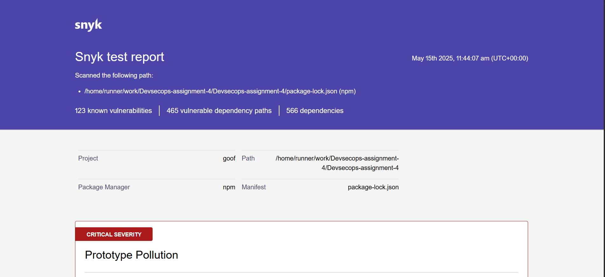
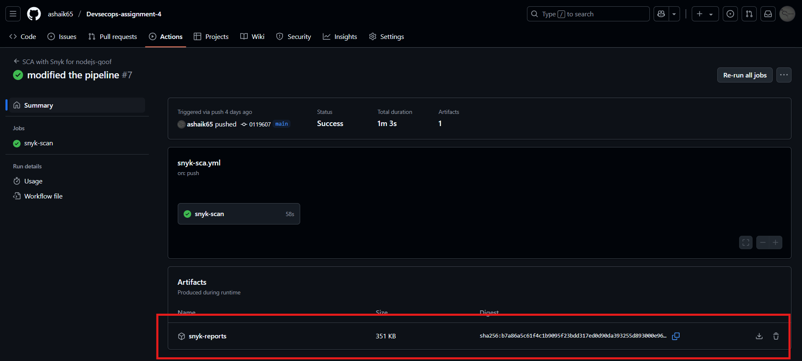

# 🔍 Software Composition Analysis (SCA) in CI/CD Pipeline — Technical Documentation

## 1. Context: Why We Are Doing This

In today’s development environment, most applications rely heavily on open-source libraries. Software Composition Analysis (SCA) ensures we can identify and mitigate vulnerabilities in these dependencies, especially transitive ones, early in the software development lifecycle.

This implementation helps to:

- Detect known vulnerabilities in direct and transitive dependencies.
- Ensure compliance with license and security standards.
- Prevent high-risk components from reaching production.

---

## 2. Tool Selection & Thought Process

✅ Selected Tool: Snyk (Community Tier)

We evaluated multiple tools from the assignment list:

| Tool                 | Reason for Rejection/Selection                        |
|----------------------|------------------------------------------------------|
| OWASP Dependency Check| Too slow and consumes GitHub Action minutes.         |
| Mend, Black Duck, JFrog Xray | Paid/Enterprise-oriented, license constraints.   |
| Snyk                 | Fast, free for small projects, JSON/HTML reporting support. ✅ |

**CI Tool Used:** GitHub Actions  
**Repository Used:** nodejs-goof

---

## 3. SCA GitHub Actions Pipeline

### 🛠️ Trigger Conditions

- On push to `main`  
- On pull request to `main`

### 🔧 Workflow Configuration (Snyk Integration)

```yaml
name: SCA with Snyk for nodejs-goof

on:
  push:
    branches: [main]
  pull_request:

jobs:
  snyk-scan:
    runs-on: ubuntu-latest
    permissions:
      contents: read

    steps:
      - name: Checkout code
        uses: actions/checkout@v3.5.3

      - name: Set up Node.js
        uses: actions/setup-node@v3.8.1
        with:
          node-version: '16'

      - name: Install dependencies
        run: npm install

      - name: Install Snyk CLI
        run: npm install -g snyk

      - name: Run Snyk test & Generate Reports
        run: |
          snyk test --json > snyk-report.json || true
          snyk test --json-file-output=snyk-report.html --report || true

          if [ ! -s snyk-report.json ] || grep -q '"vulnerabilities":\s*\[\s*\]' snyk-report.json; then
            echo "No vulnerabilities found or file is empty."
          else
            echo "Snyk report generated with vulnerabilities:"
            cat snyk-report.json
          fi
        env:
          SNYK_TOKEN: ${{ secrets.SNYK_TOKEN }}

      - name: Upload Snyk report artifacts
        uses: actions/upload-artifact@v4
        with:
          name: snyk-reports
          path: |
            snyk-report.json
            snyk-report.html
```

## A: Successful GitHub Actions Run (All Steps Visible)


## B: HTML Report Rendered View



## C: Uploaded Artifacts Section in GitHub Actions




## 4. Vulnerability Summary

| Severity | Count (approximate) |
|----------|---------------------|
| Critical | 10                  |
| High     | 45                  |
| Medium   | 38                  |
| Low      | 30                  |
| **Total**| **123**             |

Reports include package name, vulnerable versions, CVE ID, and recommended remediation.

---

## 5. Recommended Mitigations

- Upgrade vulnerable packages as suggested in the Snyk report.
- Replace libraries with no patches with maintained alternatives.
- Regularly scan codebase and enable Snyk PR checks for ongoing coverage.

📌 **Example**:

```json
{
  "package": "minimist",
  "severity": "high",
  "remediation": "Upgrade to version >=1.2.3"
}
```

## 6. Impact Analysis & Challenges

### ✅ Benefits

- Identifies risks before merge to `main`.
- JSON + HTML reports enable both automation and manual review.
- Non-blocking pipeline — vulnerabilities don’t break builds.

### 🧠 Challenges & Solutions

| Challenge                          | Solution                                                  |
|-----------------------------------|-----------------------------------------------------------|
| `snyk` command not found          | Installed globally using `npm install -g snyk`.           |
| Artifact uploaded but empty       | Handled empty report with validation and `|| true`.       |
| Pipeline failure due to vulnerabilities | Made Snyk scan non-failing for the assignment demo. |

---

## 7. Conclusion

SCA with Snyk in GitHub Actions is a reliable, fast, and scalable approach to:

- Keep open-source components secure.
- Automate feedback and vulnerability tracking.
- Provide audit-ready reports for security compliance.

🚀 This SCA implementation ensures that teams catch dependency risks before production, enhancing security posture.

---

## 🗂️ Additional Files

| File Name                         | Description                   |
|----------------------------------|-------------------------------|
| `.github/workflows/sca-snyk.yml` | CI pipeline config            |
| `snyk-report.json`               | JSON vulnerability report     |
| `snyk-report.html`               | HTML vulnerability summary    |
| `README.md`                      | Instructions and explanation  |
